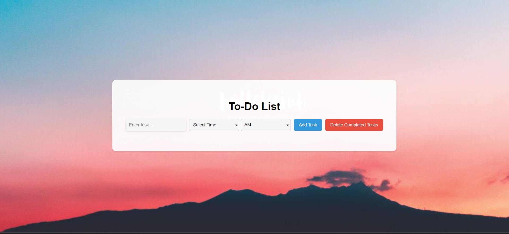

# To-Do List App

This is a simple To-Do List web application built using HTML, CSS, and JavaScript. The app allows users to create tasks, set times, and mark tasks as completed. It also features the ability to delete completed tasks and organize tasks by time.

## Features

- Add tasks with time and AM/PM selection.
- Mark tasks as completed.
- Delete completed tasks.
- Organize tasks by time.

## How to Use

1. Clone the repository or download the ZIP file.
2. Open `index.html` in a web browser to use the application.

## Screenshots

